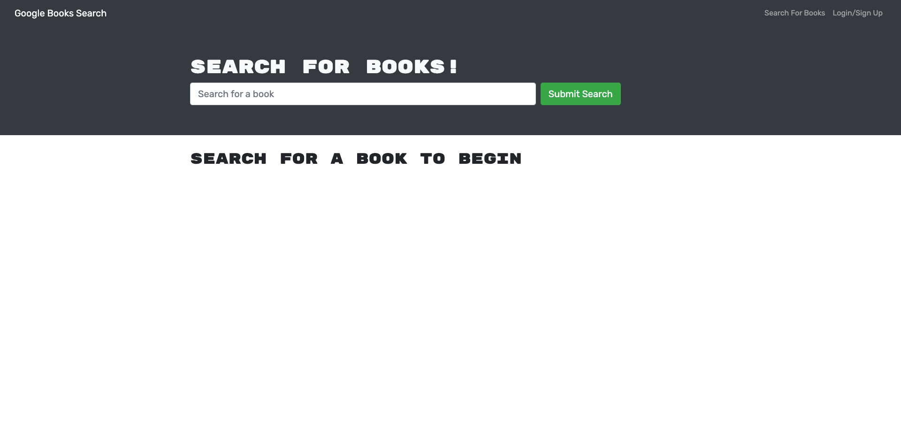
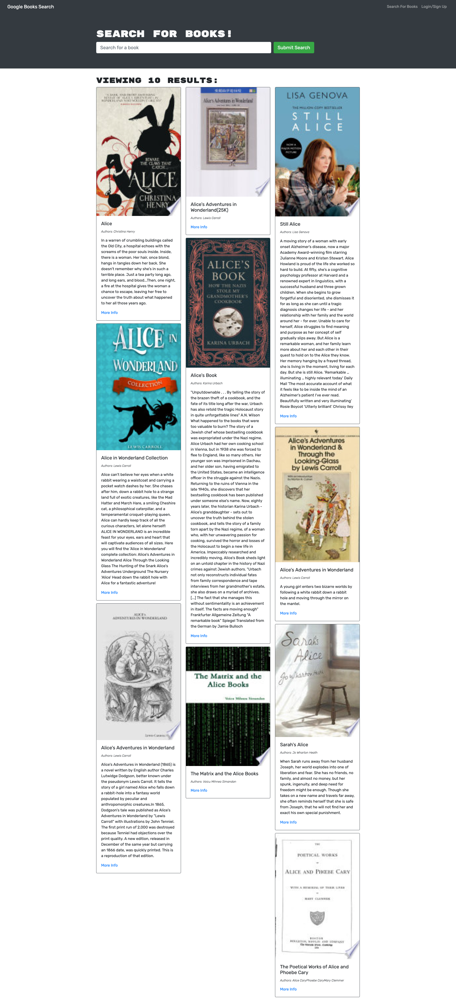
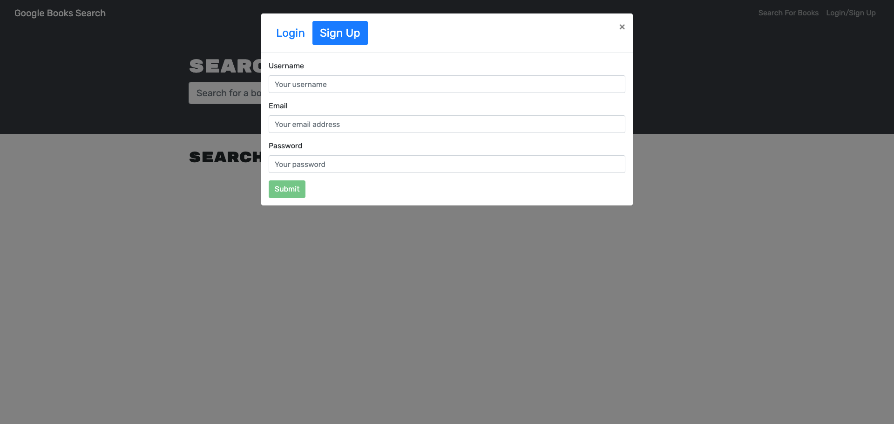

## Book Search-Front-End

#### Check the deployed app [here](https://agile-beyond-75908.herokuapp.com/)

## Table of Contents

- [Summary](#summary)
- [User Story](#user-story)
- [Technologies Used](#technologies)
- [Acceptance Criteria](#acceptance-criteria)
- [Languages](#languages)
- [Installation](#installation)
- [License](#license)
- [Questions](#questions)

<a name="summary"></a>

## Summary

A book search application powered by the Google Books API. Users can search books and then save to and delete from their accounts. The app was built using the MERN stack with a React front end, MongoDB database, and Node.js/GraphQL server and API. The application allows users to save book searches to the back end.



<a name="user-story"></a>

## User Story

```md
AS AN avid reader
I WANT to search for new books to read
SO THAT I can keep a list of books to purchase
```

<a name="acceptance-criteria"></a>

## Acceptance Criteria

```md
GIVEN a book search engine
WHEN I load the search engine
THEN I am presented with a menu with the options Search for Books and Login/Signup and an input field to search for books and a submit button
WHEN I click on the Search for Books menu option
THEN I am presented with an input field to search for books and a submit button
WHEN I am not logged in and enter a search term in the input field and click the submit button
THEN I am presented with several search results, each featuring a book’s title, author, description, image, and a link to that book on the Google Books site
WHEN I click on the Login/Signup menu option
THEN a modal appears on the screen with a toggle between the option to log in or sign up
WHEN the toggle is set to Signup
THEN I am presented with three inputs for a username, an email address, and a password, and a signup button
WHEN the toggle is set to Login
THEN I am presented with two inputs for an email address and a password and login button
WHEN I enter a valid email address and create a password and click on the signup button
THEN my user account is created and I am logged in to the site
WHEN I enter my account’s email address and password and click on the login button
THEN I the modal closes and I am logged in to the site
WHEN I am logged in to the site
THEN the menu options change to Search for Books, an option to see my saved books, and Logout
WHEN I am logged in and enter a search term in the input field and click the submit button
THEN I am presented with several search results, each featuring a book’s title, author, description, image, and a link to that book on the Google Books site and a button to save a book to my account
WHEN I click on the Save button on a book
THEN that book’s information is saved to my account
WHEN I click on the option to see my saved books
THEN I am presented with all of the books I have saved to my account, each featuring the book’s title, author, description, image, and a link to that book on the Google Books site and a button to remove a book from my account
WHEN I click on the Remove button on a book
THEN that book is deleted from my saved books list
WHEN I click on the Logout button
THEN I am logged out of the site and presented with a menu with the options Search for Books and Login/Signup and an input field to search for books and a submit button
```



<a name="languages"></a>

## Languages

- HTML5
- CSS
- JavaScript
- JQuery

## Technologies

- Node JS
- Apollo Client
- Apollo Server
- MongoDB
- Mongoose
- GraphQL
- React



<a name="installation"></a>

## Installation:

If you are interest in contribute to the code, you just need install this repository by following the steps below:

First Step:

Clone this repository, by clicking [here](https://github.com/luizfroes/get-a-book-fe). At he right hand side of the page, click on the `code` button and select the way you would like to clone the repository.

If you have your SSH keys set up, you are able to copy the link from the drop down and paste the following into your terminal application:

```
git clone git@github.com:luizfroes/get-a-book-fe.git
```

Now you just need to open your new cloned project in your chosen source-code editor.

Second Step:

Install all dependencies that are listed in the `package.json` file with the command:

```
npm install
```

Make sure you have your 'start' script in the `package.json`, as shown in the code below.

```
"start": node src/index.js
```

With this you will ensure npm to 'start' the application from your entry file.

## Database Configuration:

Set up a .env file in the back-end files, using the .env_EXAMPLE provided, including a database name and secret.

```
DB_NAME=
SECRET=
```

## How to run the application:

To run the application , use the command below in the terminal.

```
npm run start
```

<a name="license"></a>

## License


This project is licensed under the terms of the MIT license.

<a name="questions"></a>

## Questions

If you have any question or suggestion, please fell free to get in touch with me by:

Email: [luizfroes@gmail.com](mailto:luizfroes@gmail.com)

GitHub: [luizfroes](https://github.com/luizfroes)
